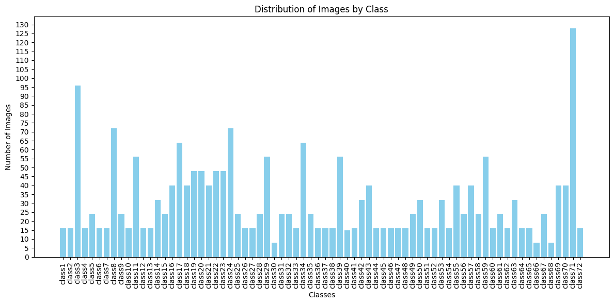
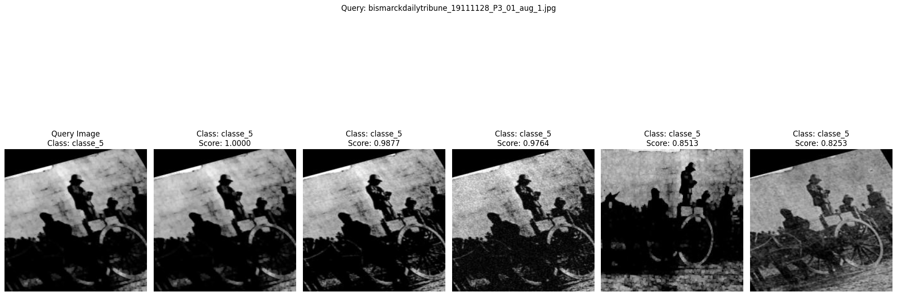
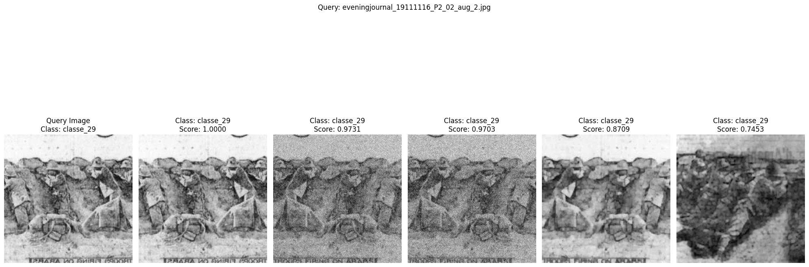
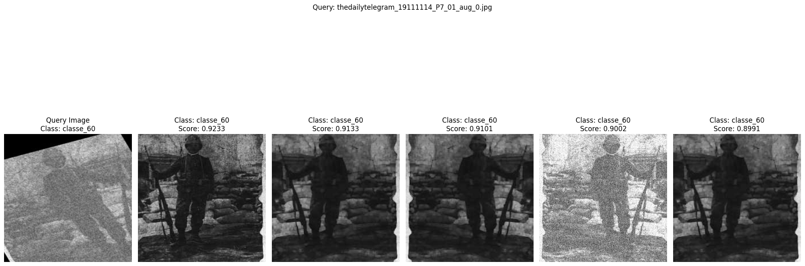
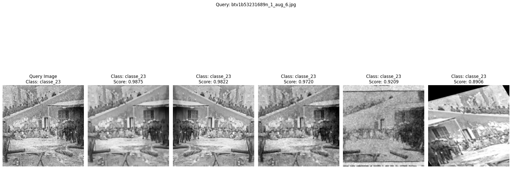
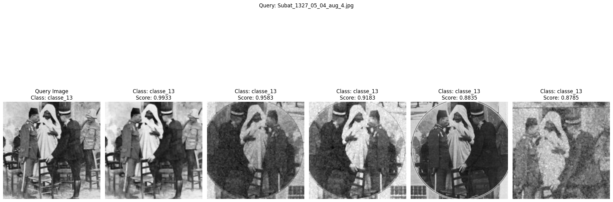

# Near Duplicate Retrieval for Historical Images

## Présenté par: Saïd BELHADJ

## Table des matières
1. [Introduction](#introduction)
2. [Les données](#les-données)
3. [Architecture proposée](#architecture-proposée)
4. [Résultats](#résultats)
5. [Exemples de Prédiction](#exemples-de-prédiction)
6. [Technologies utilisées](#technologies-utilisées)

## Introduction
Le projet "Near Duplicate Retrieval for Historical Images" vise à offrir aux historiens un outil permettant de retracer l'origine et l'utilisation des images dans les archives historiques, afin de découvrir et de corriger les usages incorrects ou falsifiés des images dans le contexte de conflits.

## Les données
Chaque ligne du fichier Excel `new_IS.xlsx` représente, dans la première colonne, un fichier original et ses "near duplicates". Le dataset initial comprend 274 images de scènes de combat et de conflits, incluant des images de cadavres et d'autres aspects graphiques des batailles. Les images sont réparties en 71 classes. 

### Préparation des données
Pour construire le dataset, chaque fichier original et tous ses near duplicates sont placés dans le même sous-dossier. Ensuite, une stratégie d'augmentation de données ciblée a été mise en place pour simuler les altérations typiques des documents anciens numérisés :

#### Types d'augmentation réalisés :
- **Ajout de Bruit** : Simuler les imperfections du scan.
- **Ajustements de Luminosité** : Reproduire les variations dues à l'usure.
- **Transformations Affines** : Imiter les distorsions physiques comme le pliage.
- **Flip Horizontal & Vertical** : Assurer la reconnaissance d'images sous différentes orientations.

Après l'augmentation des données, le dataset comprend désormais 2 192 images :
- **Entraînement** : 1 520 images (70%)
- **Validation** : 408 images (18%)
- **Test** : 264 images (12%)

#### Distribution des images après data augmentation

## Architecture proposée
Le modèle développé pour ce projet repose sur plusieurs variantes de ResNet, notamment ResNet 152, ResNet 34 et ResNet 18. Le modèle a été entraîné sur 60 epochs avec deux fonctions de coût différentes pour une tâche de classification : la cross-entropy et la triplet margin.

### Triplet Loss Model
La **Triplet Margin Loss** est utilisée pour entraîner un modèle à distinguer précisément entre des exemples positifs et négatifs dans un espace d'apprentissage métrique.

### Cross-entropy Loss Model
Un modèle parallèle utilise la **cross-entropy** pour la classification.

### Embeddings et Similarité Cosinus
Les deux pertes (Triplet Margin Loss et Cross-Entropy Loss) ont été utilisées pour entraîner le ResNet sur une tâche de classification afin de fournir des embeddings. Ces embeddings sont ensuite passés dans une PCA (Principal Component Analysis) pour réduire leur dimensionnalité, ce qui augmente la vitesse de traitement et concentre le modèle sur les caractéristiques les plus pertinentes. Enfin, une similarité cosinus est appliquée aux embeddings réduits pour retrouver les N images les plus similaires.

### Modèle Final
Le modèle final utilisé est un **ResNet34**.

#### Paramètres d'apprentissage
- **Learning rate** : lr=0.01
- **Optimizer** : Adam
- **Loss function** : Triplet Margin Loss
- **Nombre d'epochs** : 60, en 3 étapes (10, puis 40, puis 60)
- **Batch Size** : 32

## Résultats
Les performances du modèle ont été évaluées sur deux tâches principales : la classification et la récupération d'images quasi-dupliquées.

### Tâche de Classification
- **Cross Entropy Loss** : Précision de 47%, Rappel de 46%
- **Triplet Margin Loss** : Précision de 46%, Rappel de 44%

### Near Duplicate Retrieval
- **Cross Entropy Loss** :
  - Mean nDCG : 95.12%
  - Mean Top-5 Accuracy : 82%
- **Triplet Margin Loss** :
  - Mean nDCG : 97%
  - Mean Top-5 Accuracy : 82%

**Note :** Les résultats en termes de nDCG sont à nuancer. Le haut score de nDCG est en partie dû au faible nombre de groupes d'images similaires, ce qui rend les prédictions plus faciles à réaliser.

## Exemples de Prédiction
Voici quelques exemples de prédiction réalisés par notre modèle.

### Exemple 1 : 
#### Images Similaires Prédictes :

#### Images Similaires Prédictes :

#### Images Similaires Prédictes :

#### Images Similaires Prédictes :

#### Images Similaires Prédictes :

## Technologies utilisées
- **Python**
- **Libraries** : PyTorch, Pandas, NumPy, PIL, sklearn, etc.

---

Pour plus d'informations, veuillez consulter le rapport complet dans le document PDF joint.
